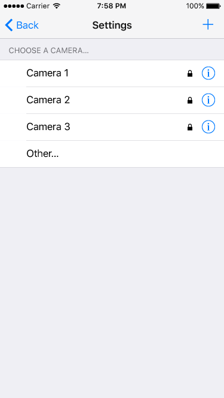
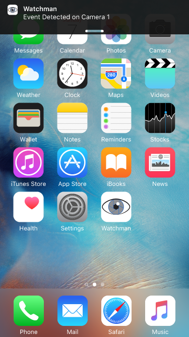
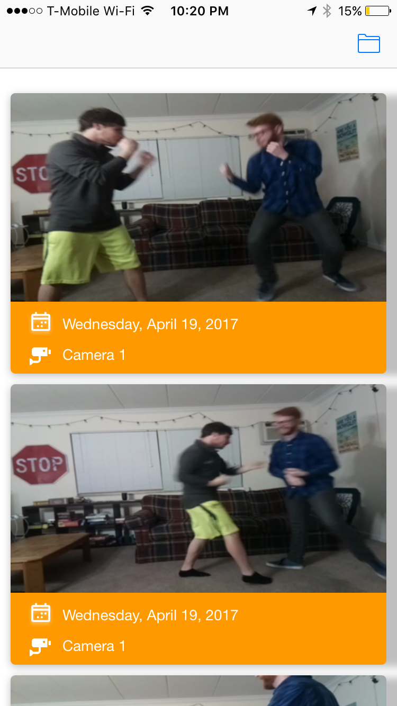
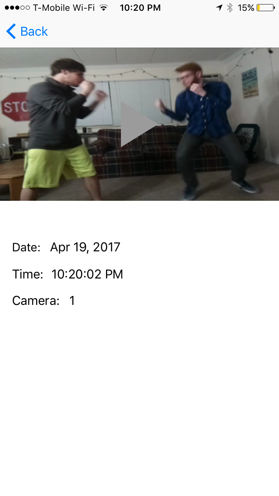

## Watchman

Watchman is a machine learning network that has learned to recognize violence in video. It can be dropped in place with an existing IP camera system as an added level of security against violent events.

Its app notification system gives real-time alerts of events it detects as violent and logs video clips of the altercations for later viewing.

## Setup
Watchman is designed to leverage IP connected cameras, smartphones, and simple installation to make video classification simple to install.

### Server
The server hosts the classification network and the notification system. The network has been pre-trained and runs automatically with the server, but a few requirements are needed to run the system. Make sure you have Python2.7 and Tensorflow installed on the system that will host the server. On Linux, it's as simple as [this](https://www.tensorflow.org/get_started/os_setup):

```markdown
$ sudo apt-get install python-pip python-dev
$ pip install tensorflow
```

To set up the system, set your camera connections in the connections.conf configuration file as such:

```markdown
cam1:192.168.200.3
cam1pword:password1

cam2:192.168.200.5
cam2pword:password2
```

Then it's a simple matter of running the watchman.py script as such:

```markdown
$ python watchman.py
```
The script will automatically connect to the IP cameras listed in configuration file and begin classification.

### App
App setup requires a connection to the messaging server. The settings menu will show currently connected cameras guide you through the setup of each camera by clicking the plus. You need the same connection info as the server configuration file:



### Using Watchman

Under normal use, the server will send push notifications to the user's device when it detects events in the video feed.



The user has the ability to pull up a list view of the logged videos. Selecting one will load a detail view of the video, allow the user to view the video by tapping it, and save notes about it. This is shown in the following images:




