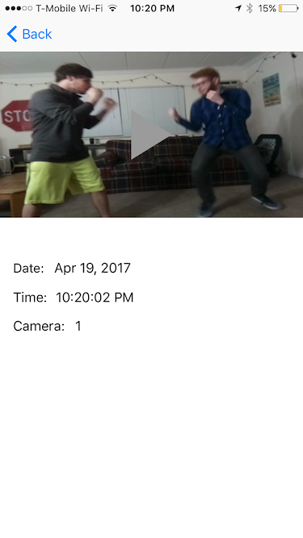

## Watchman

Watchman is a machine learning network that has learned to recognize violence in video. It can be dropped in place with an existing IP camera system as an added level of security against violent events.

Its app notification system gives real-time alerts of events it detects as violent and logs video clips of the altercations for later viewing.

## Setup
Watchman is designed to leverage IP connected cameras, smartphones, and simple installation to make video classification simple to install.

### Server
The server hosts the central notification system. It is capable of recieving event data/videos from the camera, triggering notifications and sending event data/videos to the client applications. Make sure you have Node.js, Yarn, PM2 installed on the server.

Node.js installation: https://nodejs.org/en/download/package-manager/
```markdown
curl -sL https://deb.nodesource.com/setup_7.x | sudo -E bash -
sudo apt-get install -y nodejs
```
Yarn installation: https://yarnpkg.com/lang/en/docs/install/
```markdown
$ curl -sS https://dl.yarnpkg.com/debian/pubkey.gpg | sudo apt-key add -
$ echo "deb https://dl.yarnpkg.com/debian/ stable main" | sudo tee /etc/apt/sources.list.d/yarn.list
$ sudo apt-get update && sudo apt-get install yarn
```
PM2 installation: https://www.npmjs.com/package/pm2
```markdown
$ npm install pm2 -g
```
Finally, install dependencies for this project using Yarn and run the application.

```markdown
$ yarn install
$ yarn startserver
```
All the endpoints will be available through http://localhost:8080

### App

Download the iOS app [here](https://github.com/iWatchman/iWatchman-iOS), installation instructions for which can be found 
[here](https://github.com/iWatchman/iWatchman-iOS/blob/master/README.md)

### Using Watchman

Under normal use, the server will send push notifications to the user's device when it detects events in the video feed.


The user has the ability to pull up a list view of the logged videos. Selecting one will load a detail view of the video, allow the user to view the video by tapping it. This is shown in the following images:





